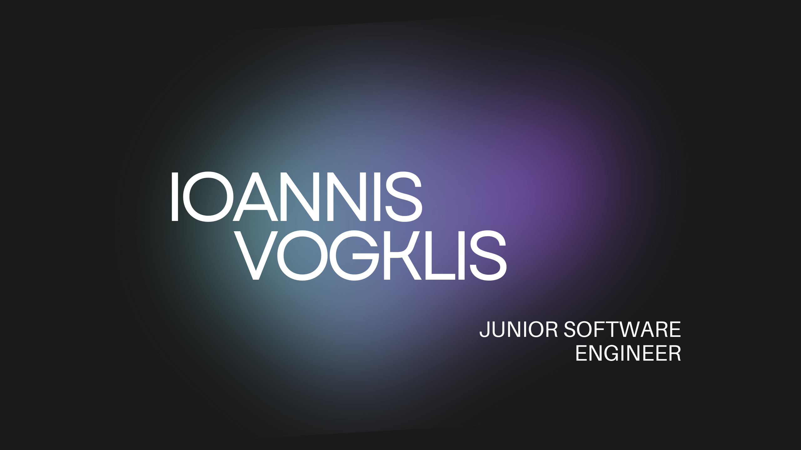

##  Hello World!, I'm Ioannis, a Greek Software engineer👋🏽:
I'm an 18-year-old software engineer passionate about coding and technology. Currently, I’m studying at IEK DELTA where I'm building a solid foundation in software development. I love exploring new technologies and learning by building interesting projects.

## 🌐 Socials:
  

# 💻 Tech Stack:
              
# 📊 GitHub Stats:
 

